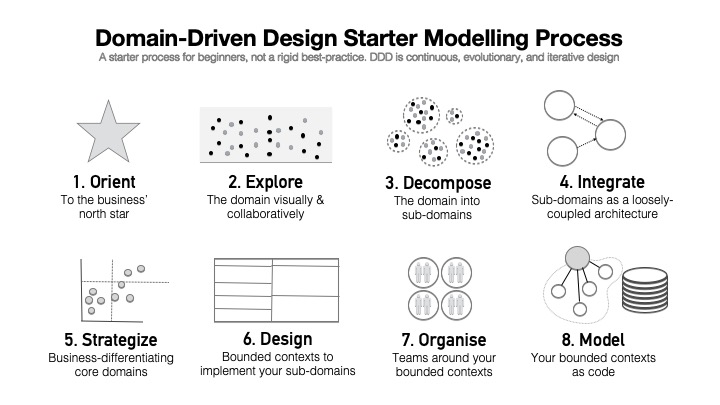

# Domain-Driven Design Starter Modelling Process

This process gives you a step-by-step guide for learning and practically applying each aspect of Domain-Driven Design -- from orienting around an organisation's business model to coding a domain model.

> This process is for beginners. It is not a linear sequence of steps that you should standardise as a best practice. Domain-Driven Design is an evolutionary design process which necessitates continuous iteration on all aspects of knowledge and design.

## The Process

### 1. Orient

### 2. Discover

### 3. Decompose

### 4. Integrate

Suggestion: rename this to "Challenge The Design with concrete use cases"

### 5. Strategize

### 6. Design

### 7. Organise

### 8. Model

## Contributors

Thank you to the following individuals who have all contributed to the DDD Starter Modelling Process:

- [Gien Verschatse](https://twitter.com/selketjah)
- [Kacper Gunia](https://github.com/cakper)
- [Nick Tune](https://github.com/ntcoding)

## Contributions and Feedback

The Domain-Driven Design Starter Modelling Process is freely available for you to use. In addition, your feedback and ideas are welcome to improve the technique or to create alternative versions. 

Feel free to also send us a pull request with your examples or experience reports.

[![CC BY 4.0][cc-by-shield]][cc-by]

This work is licensed under a [Creative Commons Attribution 4.0 International
License][cc-by].

[![CC BY 4.0][cc-by-image]][cc-by]

[cc-by]: http://creativecommons.org/licenses/by/4.0/
[cc-by-image]: https://i.creativecommons.org/l/by/4.0/88x31.png
[cc-by-shield]: https://img.shields.io/badge/License-CC%20BY%204.0-lightgrey.svg