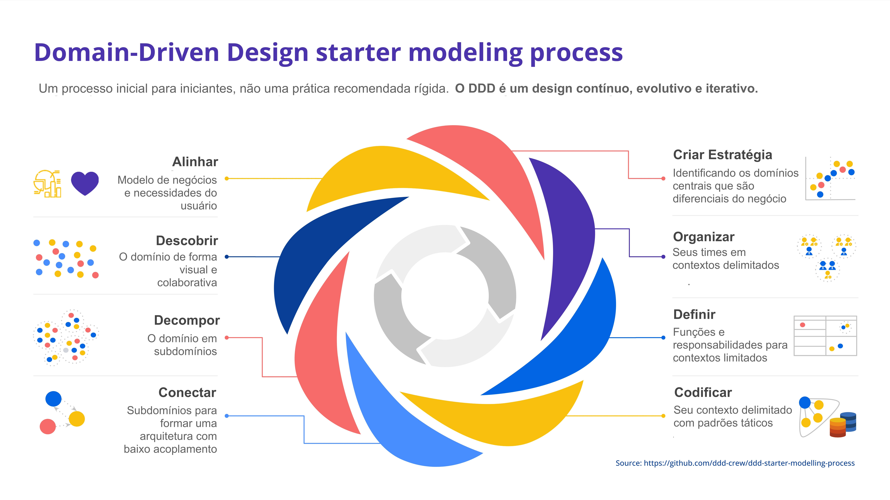
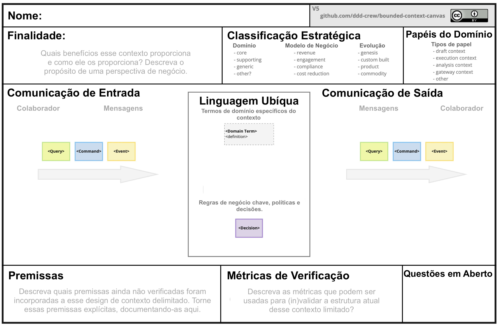

# Domain-Driven Design Starter Modelling Process

Esse processo lhe oferece um guia passo a passo para aprender e aplicar na prática cada aspecto do Domain-Driven Design (DDD) - desde a orientação em torno do modelo de negócios de uma organização até a codificação de um modelo de domínio.

O uso desse processo o guiará por cada uma das etapas essenciais do projeto de um sistema de software com a mentalidade DDD, para que você possa se concentrar nos desafios do seu negócio e não se sobrecarregar com o aprendizado do DDD ao mesmo tempo.

Depois de passar por algumas iterações do processo, você terá a teoria básica do DDD e a experiência prática para se aprofundar no DDD. Em seguida, poderá adaptar e aprimorar o processo para atender às suas necessidades em qualquer contexto. Em um projeto real, muitas vezes você estará alternando entre essas etapas.

> Esse processo é para iniciantes. Não é uma sequência linear de etapas que você deva padronizar como prática recomendada. O Domain-Driven Design é um processo de design evolutivo que exige iteração contínua em todos os aspectos do conhecimento e do design.

 

__Navegação:__

- [Domain-Driven Design Starter Modelling Process](#domain-driven-design-starter-modelling-process)
  - [Quando usar o "Domain-Driven Design Starter Modelling Process"?](#quando-usar-o-domain-driven-design-starter-modelling-process)
    - [Iniciando um projeto "Greenfield"](#iniciando-um-projeto-greenfield)
    - [Iniciando uma migração "Brownfield"](#iniciando-uma-migração-brownfield)
    - [Iniciando um programa significantemente grande](#iniciando-um-programa-significantemente-grande)
    - [Explore seu domínio para obter novas oportunidades de aprendizado](#explore-seu-domínio-para-obter-novas-oportunidades-de-aprendizado)
    - [Avalie o estado atual de seu projeto](#avalie-o-estado-atual-de-seu-projeto)
    - [Reorganizando times](#reorganizando-times)
    - [Praticando ou aprendendo DDD](#praticando-ou-aprendendo-ddd)
  - [Como adaptar o processo?](#como-adaptar-o-processo)
    - [Começando com a modelagem colaborativa](#começando-com-a-modelagem-colaborativa)
    - [Começando pela avaliação do cenário de TI](#começando-pela-avaliação-do-cenário-de-ti)
    - [Codificando antes de confirmar a arquitetura e as fronteiras dos times](#codificando-antes-de-confirmar-a-arquitetura-e-as-fronteiras-dos-times)
    - [Repita as etapas 2 (Descobrir) - 6 (Organizar) antes de passar para a 7 (Definir)](#repita-as-etapas-2-descobrir---6-organizar-antes-de-passar-para-a-7-definir)
    - [Organizando os times antes de definir os contextos](#organizando-os-times-antes-de-definir-os-contextos)
    - [Mesclando Definição e Codificação](#mesclando-definição-e-codificação)
  - [O processo](#o-processo)
    - [Alinhar](#alinhar)
      - [Ferramentas](#ferramentas)
      - [Quem involver](#quem-involver)
    - [Descobrir](#descobrir)
      - [Ferramentas](#ferramentas-1)
      - [Quem involver](#quem-involver-1)
    - [Decompor](#decompor)
      - [Ferramentas](#ferramentas-2)
      - [Quem involver](#quem-involver-2)
    - [Criar Estratégia](#criar-estratégia)
      - [Ferramentas/Recursos](#ferramentasrecursos)
      - [Quem involver](#quem-involver-3)
    - [Conectar](#conectar)
      - [Ferramentas](#ferramentas-3)
      - [Quem involver](#quem-involver-4)
    - [Organizar](#organizar)
      - [Ferramentas](#ferramentas-4)
      - [Quem involver](#quem-involver-5)
    - [Definir](#definir)
      - [Ferramentas](#ferramentas-5)
      - [Quem involver](#quem-involver-6)
    - [Codificar](#codificar)
      - [Ferramentas](#ferramentas-6)
      - [Quem involver](#quem-involver-7)
    - [Como o "Domain-Driven Design Starter Modelling Process" se relaciona com o processo Whirlpool](#como-o-domain-driven-design-starter-modelling-process-se-relaciona-com-o-processo-whirlpool)
  - [Contribuidores](#contribuidores)
  - [Contribuições e Feedback](#contribuições-e-feedback)

## Quando usar o "Domain-Driven Design Starter Modelling Process"?

Se você é novo no DDD ou não sabe por onde começar, esse processo pode reduzir sua carga cognitiva. Ele o guiará pelos cenários a seguir e possivelmente por outros:

### Iniciando um projeto "Greenfield"

No início de um novo projeto, o número de coisas em que você precisa pensar pode ser muito grande. Uma ou duas iterações desse processo podem ajudá-lo a estabelecer a fundação.

### Iniciando uma migração "Brownfield"

Antes de começar a trabalhar na modernização do sistema legado, algumas iterações desse processo podem ajudá-lo a descobrir as informações essenciais necessárias para criar uma visão da arquitetura futura.

### Iniciando um programa significantemente grande

Quando o início de uma nova iniciativa envolve um investimento significativo em várias equipes, é essencial cobrir as 8 etapas do processo. Esse processo pode orientá-lo durante as primeiras iterações.

### Explore seu domínio para obter novas oportunidades de aprendizado

O desenvolvimento de software é um processo de aprendizado. Você pode aplicar o "Domain-Driven Design Starter Modelling Process" a qualquer momento para descobrir novos insights, identificar novas oportunidades ou simplesmente compartilhar conhecimento com o seu time.

### Avalie o estado atual de seu projeto

Esse processo pode ser a base para avaliar se o seu sistema atual está alinhado ao domínio e ao modelo de negócios.  

### Reorganizando times

Uma arquitetura com baixo acoplamento permite que as equipes trabalhem em paralelo sem serem bloqueadas. Uma arquitetura com baixo acoplamento também deve estar alinhada ao acoplamento no domínio. Esse processo o ajudará a projetar uma arquitetura de software e uma estrutura de equipe alinhadas ao seu domínio.

### Praticando ou aprendendo DDD

Esse processo é ideal quando você é novo no DDD e quer praticar, ou quando quer ensinar aos outros os diferentes aspectos da modelagem de um domínio. É importante comunicar que esse processo linear não é um processo realista. É apenas um ponto de partida para reduzir a carga cognitiva até que você se sinta confiante com o DDD. 

Se quiser tentar, os colegas da SAP criaram um [DDD Kata](https://github.com/SAP/curated-resources-for-domain-driven-design/blob/main/ddd-kata.md) para ensinar como aplicar o Processo de Modelagem DDD em seu time. Com base em um conjunto de requisitos, você pode tentar algumas ferramentas como o EventStorming, o Domain Message Flow, o Bounded Context Canvas e o Aggregate Canvas, trabalhar juntos e validar suas decisões de design.

## Como adaptar o processo?

Esse processo pode ser personalizado de várias maneiras. Em um projeto real, você alternará entre as 8 etapas com base nas suas percepções durante a jornada.

Abaixo estão alguns motivos para decidir quando alterar a ordem ou alternar entre as etapas.

### Começando com a modelagem colaborativa

Se você quiser que todo time colabore imediatamente, modelar o domínio com o qual eles estão familiarizados pode ser mais confortável do que falar sobre modelos de negócios e estratégias com os quais eles ainda não conhecem.

### Começando pela avaliação do cenário de TI

Antes de se preocupar com a visão de negócios e se aprofundar no domínio, talvez seja melhor visualizar primeiro a arquitetura existente. Comece com a etapa 5 e mapeie seu portfólio estratégico para ver quais são as principais restrições que você enfrentará.

### Codificando antes de confirmar a arquitetura e as fronteiras dos times

Em alguns projetos, faz sentido começar a codificar primeiro. Talvez você precise entregar um MVP ou o domínio seja tão complexo que seja necessário criar um modelo em código antes de considerar a arquitetura.

### Repita as etapas 2 (Descobrir) - 6 (Organizar) antes de passar para a 7 (Definir)

Antes de se aprofundar na definição de contextos delimitados (Bounded Contexts), pode ser útil modelar o domínio várias vezes e procurar maneiras diferentes de decompor o sistema em subdomínios e times.

### Organizando os times antes de definir os contextos

Em muitos projetos, há restrições organizacionais que precisam ser levadas em conta. Se esse for o caso, você pode considerar as estruturas de times ao invés de projetar arquiteturas que nunca conseguirá implementar.

### Mesclando Definição e Codificação

As etapas 7 (Definir) e 8 (Codificar) podem ocorrer simultaneamente. Isso pode acontecer quando você está codificando um contexto delimitado (Bounded Context) e os insights que obtém ao escrever o código fazem com que você altere o design geral.

## O processo

O processo de modelagem é composto de 8 etapas que são apresentadas a seguir.

Uma boa palestra que oferece uma visão geral do processo no contexto das fases típicas do projeto de arquiteturas sociotécnicas é ["Sociotechnical Architecture: co-designing technical & organizational architecture to maximize impact"](https://www.youtube.com/watch?v=ekMPm78KFj0&feature=youtu.be&t=1820) de [Eduardo da Silva](https://twitter.com/emgsilva). Eduardo agrupa as atividades do processo e suas 8 etapas em [quatro fases distintas](https://speakerdeck.com/emgsilva/intro-to-sociotechnical-architecture-co-designing-technical-and-organizational-architecture-to-maximize-impact?slide=31), nomeadas:

1. Alinhar & Compreender.
2. Arquitetura Estratégica.
3. Estratégia e Design Organizacional.
4. Arquitetura Tática.

### Alinhar

Alinhar nosso foco com o modelo de negócios da organização, as necessidades de seus usuários e suas metas de curto, médio e longo prazo.

Cada decisão que tomamos em relação à arquitetura, ao código ou à organização tem consequências para os negócios e para os usuários. Para projetar, criar e desenvolver sistemas de software de forma mais eficaz, nossas decisões precisam criar o impacto comercial ideal, o que só pode ser alcançado se estivermos alinhados com as metas de negócio, além de dar suporte às necessidades atuais e futuras potenciais dos usuários.

A arquitetura e/ou os contextos delimitados mal projetados podem ter um impacto negativo ou até mesmo impossibilitar o alcance desses objetivos.

Como ponto de partida, recomendamos [The Business Model Canvas](https://www.strategyzer.com/canvas/business-model-canvas) para a perspectiva de negócio, [User Story Mapping](https://www.jpattonassociates.com/user-story-mapping/) para entender o ponto de vista do usuário.

#### Ferramentas

- [Impact Mapping](https://www.impactmapping.org/)
- [O "Business Model Canvas"](https://www.strategyzer.com/canvas/business-model-canvas)
- [O "Product Strategy Canvas"](https://melissaperri.com/blog/2016/07/14/what-is-good-product-strategy)
- [Wardley Mapping](https://learnwardleymapping.com/)
- [User Story Mapping](https://www.jpattonassociates.com/user-story-mapping/)

#### Quem involver

- Pessoas que projetam, criam e testam software
- Pessoas que têm conhecimento do domínio
- Pessoas que entendem o produto e a estratégia de negócios
- Usuários finais reais, não apenas seus representantes em sua organização

### Descobrir

Descubra o domínio de forma visual e colaborativa.

Esse é o aspecto mais importante do DDD. Não se pode ignorar a descoberta. Se toda a sua equipe não tiver um bom entendimento do domínio, todas as decisões de software serão mal orientadas.

A disseminação do conhecimento do domínio por toda a equipe criará um entendimento compartilhado. Isso permite que os desenvolvedores criem um sistema de software alinhado ao domínio, que pode ser mais flexível para incorporar futuras mudanças nos negócios. 

Garantir que o conhecimento do domínio seja disseminado por toda a equipe permite que seus membros contribuam com ideias para melhorar o produto.

> #### A descoberta é contínua
>
> Os times que têm sucesso com o DDD praticam técnicas de descoberta com frequência. Sempre há mais a aprender sobre o domínio.
>
> Na primeira tentativa de descoberta, um facilitador pode usar técnicas como o EventStorming pode ajudar o time a ver os verdadeiros benefícios da descoberta além de um nível superficial.
>
> Recomendamos que você dê uma olhada em [Visual Collaboration Tools](https://leanpub.com/visualcollaborationtools).

Como ponto de partida, recomendamos [EventStorming](https://www.eventstorming.com/).

#### Ferramentas

- [Domain Storytelling](https://domainstorytelling.org/)
- [Example Mapping](https://cucumber.io/blog/bdd/example-mapping-introduction/)
- [EventStorming](https://www.eventstorming.com/)
- [User Journey Mapping](https://boagworld.com/audio/customer-journey-mapping/)
- [User Story Mapping](https://www.jpattonassociates.com/user-story-mapping/)

#### Quem involver

- Pessoas que projetam, criam e testam software
- Pessoas que têm conhecimento do domínio
- Pessoas que entendem de estratégia de produtos e negócios
- Pessoas que entendem as necessidades e os problemas dos clientes
- Usuários finais reais

### Decompor

Decompor o domínio em subdomínios - partes do domínio com baixo acoplamento.

Decompomos um domínio maior de problemas em subdomínios por alguns motivos importantes:

- carga cognitiva reduzida, para que possamos raciocinar sobre partes do domínio de forma independente,
- dar autonomia aos times de desenvolvimento, para que eles possam trabalhar em partes separadas da solução,
- identificar o baixo acoplamento e a alta coesão no domínio, o que é transferido para nossa arquitetura de software e estrutura de times.

Como ponto de partida, recomendamos dividir seu "Event Storming" em subdomínios e [Context Maps](https://speakerdeck.com/mploed/visualizing-sociotechnical-architectures-with-context-maps).

*Crédito: Alberto Brandolini*

#### Ferramentas

- [Modelagem de capacidade de negócios](https://www.slideshare.net/trondhr/from-capabilities-to-services-modelling-for-businessit-alignment-v2)
- [Heurísticas de design](https://www.dddheuristics.com/)
- [EventStorming com subdomínios](https://www.eventstorming.com/)
- [Heurísticas de serviços independente](https://github.com/TeamTopologies/Independent-Service-Heuristics)
- [Visualizando a arquitetura sociotécnica com "Context Mappings"](https://speakerdeck.com/mploed/visualizing-sociotechnical-architectures-with-context-maps)

#### Quem involver

- Pessoas que projetam, criam e testam software
- Pessoas que têm conhecimento do domínio

### Criar Estratégia

Mapeie estrategicamente seus subdomínios para identificar os domínios principais: as partes do domínio que têm o maior potencial de diferenciação comercial ou importância estratégica.

O tempo e os recursos são limitados, portanto, entender em quais partes do domínio se concentrar é fundamental para proporcionar um impacto comercial ideal.

Ao analisar quais são seus domínios principais, você terá uma ideia melhor de quanta qualidade e rigor são necessários para criar cada parte do seu sistema e poderá tomar decisões altamente embasadas de criar, comprar ou terceirizar.

Como ponto de partida, recomendamos [Core Domain Charts](https://github.com/ddd-crew/core-domain-charts).

#### Ferramentas/Recursos

- [Core Domain Charts](https://github.com/ddd-crew/core-domain-charts)
- [Purpose Alignment Model](https://www.informit.com/articles/article.aspx?p=1384195&seqNum=2)
- [Wardley Mapping](https://learnwardleymapping.com/)
- [Revisitando os fundamentos do Domain-Driven Design](https://vladikk.com/2018/01/26/revisiting-the-basics-of-ddd/)

#### Quem involver

- Pessoas que entendem de estratégia de produtos e negócios
- Pessoas que projetam, criam e testam software
- Pessoas que têm conhecimento do domínio

### Conectar

Conecte os subdomínios em uma arquitetura com baixo acoplamento que atenda aos casos de uso de negócios de ponta a ponta.

É imperativo não apenas decompor um grande domínio em partes, mas também projetar cuidadosamente as interações entre essas partes para minimizar o acoplamento e a complexidade indesejados. É necessário desafiar o projeto inicial aplicando casos de uso concretos para descobrir a complexidade oculta.

Como ponto de partida, recomendamos [Domain Message Flow Modelling](https://github.com/ddd-crew/domain-message-flow-modelling).

#### Ferramentas

- ["Business Process Model" e "Notation"](https://en.wikipedia.org/wiki/Business_Process_Model_and_Notation)
- ["Domain Message Flow Modelling"](https://github.com/ddd-crew/domain-message-flow-modelling)
- ["Process Modelling EventStorming"](https://www.eventstorming.com/)
- [Diagramas de Sequência](https://en.wikipedia.org/wiki/Sequence_diagram)

#### Quem involver

- Pessoas que projetam, criam e testam software
- Pessoas que têm conhecimento do domínio

### Organizar

Organize times autônomos que sejam otimizados para um fluxo rápido e alinhados com os contextos delimitados.

Os times precisam ser organizados para ter autonomia, metas claras e senso de propósito. Para isso, precisamos levar em conta as restrições organizacionais, de modo que os times se organizem para um fluxo rápido. 

> #### Auto-organização da equipe
>
> A organização dos times não é algo que é feito pelos times, mas eles devem estar envolvidos no processo de definição de seus limites, interações e responsabilidades.
>
> Algumas empresas, como a Red Gate Software, capacitam e confiam em suas equipes para [organizar-se com autonomia](https://medium.com/ingeniouslysimple/how-redgate-ran-its-first-team-self-selection-process-4bfac721ae2).

Podemos otimizar a forma como as pessoas colaboram umas com as outras se alinharmos as equipes com os limites do contexto. Para dimensionar corretamente as equipes, precisamos levar em conta o talento disponível, a carga cognitiva, a sobrecarga de comunicação e o fator ônibus. 

Como ponto de partida, recomendamos visualizar a arquitetura sociotécnica com o [Context Maps](https://speakerdeck.com/mploed/visualizing-sociotechnical-architectures-with-context-maps). Uma breve visão geral dos padrões mais importantes pode ser encontrada na seção [context-mapping](https://github.com/ddd-crew/context-mapping) GitHub Project.

*Crédito: Michael Plöd*

#### Ferramentas

- ["Dynamic Reteaming"](https://leanpub.com/dynamicreteaming) 
- ["Pioneers, Settlers & Town Planners"](http://wardleypedia.org/mediawiki/index.php/Pioneers_settlers_town_planners)
- ["Team Topologies"](https://teamtopologies.com/)
- [Visualizando a arquitetura sociotécnica com "Context Maps"](https://speakerdeck.com/mploed/visualizing-sociotechnical-architectures-with-context-maps)

#### Quem involver

- Pessoas que projetam, criam e testam software
- Pessoas que têm conhecimento do domínio
- Pessoas que entendem o produto e a estratégia de negócios

### Definir

Definir as funções e responsabilidades de cada  ["bounded context"](https://martinfowler.com/bliki/BoundedContext.html).

Antes de se comprometer com um projeto, tome decisões explícitas sobre as escolhas que podem ter um impacto significativo no projeto geral. Tenha essas conversas logo no início, enquanto ainda é fácil mudar de ideia e explorar modelos alternativos.

Projete de forma colaborativa e visual, e comece a considerar as limitações técnicas para que você possa descobrir restrições ou oportunidades.

Como ponto de partida, recomendamos o ["Bounded Context Canvas"](https://github.com/ddd-crew/bounded-context-canvas).

#### Ferramentas

- ["Bounded Context Canvas"](https://github.com/ddd-crew/bounded-context-canvas)
- [Diagrama de contexto do sistema C4](https://c4model.com/#SystemContextDiagram)
- ["Quality Storming"](https://speakerdeck.com/mploed/quality-storming)

#### Quem involver

- Pessoas que projetam, criam e testam software
- Pessoas que têm conhecimento do domínio
- Pessoas que são responsáveis pelo produto

### Codificar

Codifique o modelo de domínio.

Alinhar o código ao domínio facilita a alteração do código quando o domínio muda. Ao modelar de forma colaborativa o espaço do problema com especialistas, os desenvolvedores têm a chance de aprender sobre o domínio e minimizar os mal-entendidos.

Como ponto de partida, recomendamos o ["Aggregate Design Canvas"](https://github.com/ddd-crew/aggregate-design-canvas).

#### Ferramentas

- ["Aggregate Design Canvas"](https://github.com/ddd-crew/aggregate-design-canvas)
- ["Diagramas de componentes C4"](https://c4model.com/#ComponentDiagram)
- ["Design-Level EventStorming"](https://www.eventstorming.com/)
- ["Event Modeling"](https://eventmodeling.org/posts/what-is-event-modeling/)
- ["Hexagonal Architecture"](https://en.wikipedia.org/wiki/Hexagonal_architecture_(software))
- ["Mob Programming"](https://mobprogramming.org/)
- ["Model Exploration Whirlpool"](https://domainlanguage.com/ddd/whirlpool/)
- ["Onion Architecture"](https://jeffreypalermo.com/2008/07/the-onion-architecture-part-1/)
- ["Unified Modelling Language"](https://en.wikipedia.org/wiki/Unified_Modeling_Language)

#### Quem involver

- Pessoas que projetam, criam e testam software

### Como o "Domain-Driven Design Starter Modelling Process" se relaciona com o processo Whirlpool 
  
Alguns de vocês devem ter notado algumas semelhanças com o livro de Eric Evans [Whirlpool Process](https://www.domainlanguage.com/ddd/whirlpool/). E, de fato, ambos são guias e não práticas recomendadas rígidas. Eles também são contínuos e iterativos.
Mas o Processo Initial de DDD é mais agrangente do que o processo Whirlpool, pois visa à criação de uma arquitetura sociotécnica.  
A figura abaixo mostra uma possível sobreposição entre os dois processos.  

  

Não é preciso dizer que o processo Whirlpool de Eric Evan continua totalmente relevante até hoje e oferece às pessoas percepções e orientações muito valiosas sobre como explorar modelos.

## Contribuidores

Obrigado a todos [contribuidores atuais e futuros](https://github.com/ddd-crew/ddd-starter-modelling-process/graphs/contributors) e às seguintes pessoas que contribuíram para o "Domain-Driven Design Starter Modelling Process":

- [Ciaran McNulty](https://github.com/ciaranmcnulty)
- [Eduardo da Silva](https://github.com/emgsilva)
- [Gien Verschatse](https://twitter.com/selketjah)
- [James Morcom](https://twitter.com/morcs)
- [Maxime Sanglan-Charlier](https://twitter.com/__MaxS__)

## Contribuições e Feedback

O "Domain-Driven Design Starter Modelling Process" está disponível gratuitamente para seu uso. Além disso, seus comentários e ideias são bem-vindos para aprimorar a técnica ou criar versões alternativas.

Se tiver dúvidas, você pode nos contactar ou abrir um [Issue](https://github.com/ddd-crew/ddd-starter-modelling-process/issues/new/choose).

Sinta-se à vontade para também nos enviar pull-requests com seus [estudos de caso](/case-studies).

[![CC BY 4.0][cc-by-shield]][cc-by]

ste trabalho está licenciado sob uma licença [Creative Commons Attribution 4.0 International
License][cc-by].

[![CC BY 4.0][cc-by-image]][cc-by]

[cc-by]: http://creativecommons.org/licenses/by/4.0/
[cc-by-image]: https://i.creativecommons.org/l/by/4.0/88x31.png
[cc-by-shield]: https://img.shields.io/badge/License-CC%20BY%204.0-lightgrey.svg
