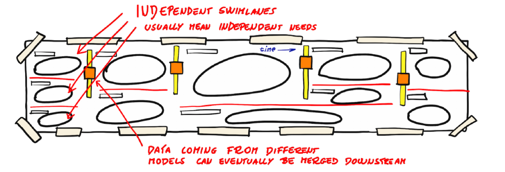
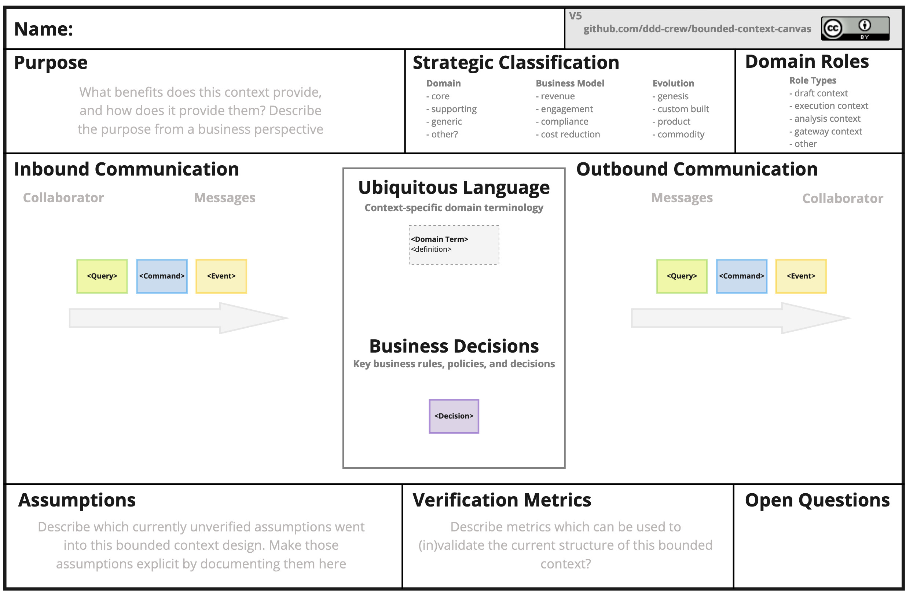
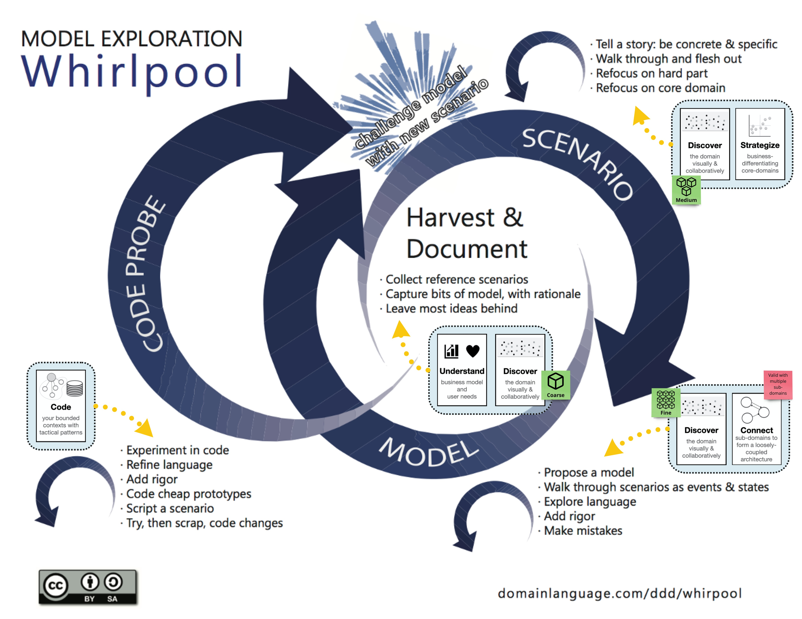

# 領域驅動設計 (DDD) 建模流程入門

<!-- # Domain-Driven Design Starter Modelling Process -->

    
這個流程為你提供逐步指南，以學習並實際應用領域驅動設計 (DDD) 的每個方面 - 從圍繞組織的商業模型到編碼領域模型。

> This process gives you a step-by-step guide for learning and practically applying each aspect of Domain-Driven Design (DDD) - from orienting around an organisation's business model to coding a domain model.

    
使用此流程將引導你完成使用 DDD 思維設計軟體系統的每個必要步驟，以便你可以專注於你的業務挑戰，而不會同時被學習 DDD 搞得不知所措。

> Using this process will guide you through each of the essential steps in designing a software system with the DDD mindset, so you can focus on your business challenges and not be overwhelmed by learning DDD at the same time.

    
經過幾次迭代後，你將具備基礎的 DDD 理論和實務經驗，可以更深入瞭解 DDD。然後，你將能夠調整和改進流程，以滿足你在任何情境下的需求。在實際專案中，你通常會在這些步驟之間來回跳躍。

> Once you have been through a few iterations of the process you will have the foundational DDD theory and practical experience to go deeper into DDD. Then you will be able to adapt and improve the process to suit your needs in any context. On a real project you'll often be jumping back and forth between these steps.

> 這個流程適合初學者，而且它不是你應該標準化為最佳實務的實作步驟，領域驅動設計是一種演進式設計程式，需要對知識和設計的所有方面進行持續迭代。

<!-- > This process is for beginners. It is not a linear sequence of steps that you should standardise as a best practice. Domain-Driven Design is an evolutionary design process which necessitates continuous iteration on all aspects of knowledge and design. -->

    
導覽：

> __Navigation:__

- [領域驅動設計 (DDD) 建模流程入門](#領域驅動設計-ddd-建模流程入門)
  - [何時使用 DDD 建模流程入門？](#何時使用-ddd-建模流程入門)
    - [開始一個 Greenfield 專案](#開始一個-greenfield-專案)
    - [開始一個 Brownfield 遷移](#開始一個-brownfield-遷移)
    - [展開一項重大工作計劃](#展開一項重大工作計劃)
    - [探索你的領域以獲取新的學習機會](#探索你的領域以獲取新的學習機會)
    - [評估專案的當前狀態](#評估專案的當前狀態)
    - [重新組織團隊](#重新組織團隊)
    - [練習或學習 DDD](#練習或學習-ddd)
  - [如何調整流程？](#如何調整流程)
    - [從協作建模開始](#從協作建模開始)
    - [從評估 IT 環境開始](#從評估-it-環境開始)
    - [在確認架構和團隊界限之前編寫程式碼](#在確認架構和團隊界限之前編寫程式碼)
    - [重複步驟 2（發現）~ 步驟 6（組織）然後再進行步驟 7（定義）](#重複步驟-2發現-步驟-6組織然後再進行步驟-7定義)
    - [在設計情境之前組織團隊](#在設計情境之前組織團隊)
    - [混合定義與編碼](#混合定義與編碼)
  - [流程](#流程)
    - [步驟 1: 瞭解 (Understand)](#步驟-1-瞭解-understand)
      - [工具](#工具)
      - [誰應該參與](#誰應該參與)
    - [步驟 2: 探索 (Discover)](#步驟-2-探索-discover)
      - [工具](#工具-1)
      - [誰應該參與](#誰應該參與-1)
    - [步驟 3: 分解 (Decompose)](#步驟-3-分解-decompose)
      - [工具](#工具-2)
      - [誰應該參與](#誰應該參與-2)
    - [步驟 4: 策略 (Strategize)](#步驟-4-策略-strategize)
      - [工具/資源](#工具資源)
      - [誰應該參與](#誰應該參與-3)
    - [步驟 5: 連接 (Connect)](#步驟-5-連接-connect)
      - [工具](#工具-3)
      - [誰應該參與](#誰應該參與-4)
    - [步驟 6: 組織 (Organise)](#步驟-6-組織-organise)
      - [工具](#工具-4)
      - [誰應該參與](#誰應該參與-5)
    - [步驟 7: 定義 (Define)](#步驟-7-定義-define)
      - [工具](#工具-5)
      - [誰應該參與](#誰應該參與-6)
    - [步驟 8: 程式碼 (Code)](#步驟-8-程式碼-code)
      - [工具](#工具-6)
      - [誰應該參與](#誰應該參與-7)
    - [DDD 建模流程入門與 Whirlpool 流程的關聯](#ddd-建模流程入門與-whirlpool-流程的關聯)
  - [貢獻者](#貢獻者)
  - [貢獻與回饋](#貢獻與回饋)

<!--
- [Domain-Driven Design Starter Modelling Process](#domain-driven-design-starter-modelling-process)
  - [When to use the DDD Starter Modelling Process?](#when-to-use-the-ddd-starter-modelling-process)
    - [Kicking Off a Greenfield Project](#kicking-off-a-greenfield-project)
    - [Beginning a Brownfield Migration](#beginning-a-brownfield-migration)
    - [Kicking Off a Major Program of Work](#kicking-off-a-major-program-of-work)
    - [Explore Your Domain for New Learning Opportunities](#explore-your-domain-for-new-learning-opportunities)
    - [Assess Current State of Your Project](#assess-current-state-of-your-project)
    - [Re-organising Teams](#re-organising-teams)
    - [Practicing or Learning DDD](#practicing-or-learning-ddd)
  - [How to Adapt the Process?](#how-to-adapt-the-process)
    - [Start with Collaborative Modelling](#start-with-collaborative-modelling)
    - [Start by Assessing IT Landscape](#start-by-assessing-it-landscape)
    - [Code Before Confirming Architecture and Team Boundaries](#code-before-confirming-architecture-and-team-boundaries)
    - [Repeat Steps 2 (Discover) - 6 (Organise) Before Moving to 7 (Define)](#repeat-steps-2-discover---6-organise-before-moving-to-7-define)
    - [Organise Teams Before Designing Contexts](#organise-teams-before-designing-contexts)
    - [Blending Definition and Coding](#blending-definition-and-coding)
  - [The Process](#the-process)
    - [Understand](#understand)
      - [Tools](#tools)
      - [Who to Involve](#who-to-involve)
    - [Discover](#discover)
      - [Tools](#tools-1)
      - [Who to Involve](#who-to-involve-1)
    - [Decompose](#decompose)
      - [Tools](#tools-2)
      - [Who to Involve](#who-to-involve-2)
    - [Strategize](#strategize)
      - [Tools/Resources](#toolsresources)
      - [Who to Involve](#who-to-involve-3)
    - [Connect](#connect)
      - [Tools](#tools-3)
      - [Who to Involve](#who-to-involve-4)
    - [Organise](#organise)
      - [Tools](#tools-4)
      - [Who to Involve](#who-to-involve-5)
    - [Define](#define)
      - [Tools](#tools-5)
      - [Who to Involve](#who-to-involve-6)
    - [Code](#code)
      - [Tools](#tools-6)
      - [Who to Involve](#who-to-involve-7)
    - [How the DDD Starter Modelling Process relates to the Whirlpool Process](#how-the-ddd-starter-modelling-process-relates-to-the-whirlpool-process)
  - [Contributors](#contributors)
  - [Contributions and Feedback](#contributions-and-feedback)
-->

## 何時使用 DDD 建模流程入門？
<!-- ## When to use the DDD Starter Modelling Process? -->

    
如果你是 DDD 的新手，或者只是不確定從哪裡開始，這個過程可以減輕你的認知負擔。它將引導你遵循以下情境，可能還有其他情境：

> If you're new to DDD or just not sure where to start, this process can reduce your cognitive load. It will guide you through following scenarios, and possibly others:

### 開始一個 Greenfield 專案
<!-- ### Kicking Off a Greenfield Project -->

    
在開始一個新專案時，你需要考慮的事情可能會多到令人不知所措。重複這個過程一兩次，可以幫助你建立基礎。

> At the start of a new project the number of things you need to think about can be overwhelming. One or two iterations of this process can help you put the foundations in place.

### 開始一個 Brownfield 遷移
<!-- ### Beginning a Brownfield Migration -->

    
在開始現代化你的舊系統之前，此程式的幾次迭代可以幫助你發現建立目標架構願景所需的必要資訊。

> Before getting to work on modernising your legacy system, a few iterations of this process can help you to uncover essential information needed to create a vision for your target architecture.

### 展開一項重大工作計劃
<!-- ### Kicking Off a Major Program of Work -->

    
當啟動一項新計劃涉及多個團隊的大量投資時，涵蓋流程中的 8 個步驟至關重要。此流程可以引導你完成前幾次迭代。

> When starting a new initiative involves a significant investment across many teams, it is essential to cover the 8 steps in the process. This process can guide you through the first few iterations.

### 探索你的領域以獲取新的學習機會
<!-- ### Explore Your Domain for New Learning Opportunities -->

    
軟體開發是一個學習的過程。你可以隨時應用 DDD 建模流程入門來發現新的見解、識別新的機會，或只是在團隊中分享知識。

> Software development is a learning process. You can apply the DDD Starter Modelling Process at any time to uncover new insights, identify new opportunities, or simply share knowledge around the team.

### 評估專案的當前狀態
<!-- ### Assess Current State of Your Project -->

    
這個過程可以作為評估你目前的系統與領域和商業模型的契合程度的基礎。

> This process can be the foundation for assessing how well your current system is aligned to the domain and business model.

### 重新組織團隊
<!-- ### Re-organising Teams -->

    
鬆散耦合的架構使團隊能夠並行工作而不會受到阻礙。鬆散耦合的架構也必須與領域中的耦合保持一致。此過程將幫助你設計軟體架構，以及與你的領域一致的團隊結構。

> A loosely-coupled architecture enables teams to work in parallel without being blocked. A loosely-coupled architecture also must be aligned to coupling in the domain. This process will help you to design a software architecture, and a team structure aligned with your domain.

### 練習或學習 DDD
<!-- ### Practicing or Learning DDD -->

    
這個過程在你剛接觸 DDD 並想練習時非常理想，或者你想教導他人建模領域的不同面向。重要的是要傳達這個線性過程並非實際的過程。這只是一個起點，可以減少認知負擔，直到你對 DDD 有信心為止。

> This process is ideal when you are new to DDD and want to practice, or you want to teach others the different aspects of modelling a domain. It's important to communicate that this linear process is not a realistic process. It's just a starting point to reduce cognitive load until you are confident with DDD.

    
如果你想親自嘗試，SAP 的同事已建立一個 <a href="https://github.com/SAP/curated-resources-for-domain-driven-design/blob/main/ddd-kata.md">DDD Kata</a> 來教育團隊，如何在你的團隊中應用 DDD 建模流程。根據一組需求，你可以嘗試 EventStorming、Domain Message Flow、Bounded Context Canvas 和 Aggregate Canvas 如何協同運作，並幫助你驗證你的設計決策。

> If you want to try it out yourself, colleagues at SAP have created a [DDD Kata](https://github.com/SAP/curated-resources-for-domain-driven-design/blob/main/ddd-kata.md) to educate teams, how to apply the DDD Modelling Process in your team. Based upon a set of requirements, you can try out how EventStorming, Domain Message Flow, Bounded Context Canvas and Aggregate Canvas work together and help you to validate your design decisions.

## 如何調整流程？
<!-- ## How to Adapt the Process? -->

    
這個過程可以透過多種方式進行自訂。在一個真實的專案中，你將根據獲得或需要獲得的新見解在所有 8 個步驟之間進行切換。

> This process can be customised in many ways. On a real project, you'll be switching between all 8 steps based on the new insights you gain or need to gain.

    
以下是一些決定何時更改順序或在步驟之間切換的原因。

> Below are a few reasons for deciding when to change the order or switch between steps.

### 從協作建模開始
<!-- ### Start with Collaborative Modelling -->

    
如果你想讓整個團隊立即展開協作，建模他們熟悉的領域可能比談論他們不太熟悉的商業模型和策略更為舒適。

> If you want to get your whole team collaborating immediately, modelling the domain which they are familiar with might be more comfortable than talking about business models and strategy which they are less comfortable with.

### 從評估 IT 環境開始
<!-- ### Start by Assessing IT Landscape -->

    
在展望業務願景並深入領域之前，最好先視覺化現有架構。從步驟 5 開始，並繪製你的策略組合，以瞭解你將面臨的主要限制。

> Before looking forward to the business vision and going deep into the domain, it might be better to visualise the existing architecture first. Start with step 5 and map out your strategic portfolio to see what the major constraints you will face are.

### 在確認架構和團隊界限之前編寫程式碼
<!-- ### Code Before Confirming Architecture and Team Boundaries -->

    
在某些專案中，提早開始撰寫程式碼是有道理的。也許你需要交付 MVP，或者該領域非常複雜，以至於在考慮架構之前，必須在程式碼中建立模型。

> On some projects it makes sense to start by writing code sooner. Perhaps you need to deliver an MVP or the domain is so complex that creating a model in code is necessary before you can consider the architecture.

### 重複步驟 2（發現）~ 步驟 6（組織）然後再進行步驟 7（定義）
<!-- ### Repeat Steps 2 (Discover) - 6 (Organise) Before Moving to 7 (Define) -->

    
在深入瞭解個別邊界上下文的定義之前，建模多個領域並尋找將系統分解為子領域和團隊的不同方法可能是有益的。

> Before you dive into the definition of individual bounded contexts, it may be beneficial to model the domain multiple times and look for different ways to decompose your system into sub-domains and teams.

### 在設計情境之前組織團隊
<!-- ### Organise Teams Before Designing Contexts -->

    
對於許多專案而言，我們需要考慮組織限制。如果是這樣，你應該考慮在設計永遠無法實施的架構之前，識別可能的團隊結構。

> For a great deal of projects there are organisational constraints that we need to take into account. If this is the case, you should consider identifying possible team structures before designing architectures that you will never be able to implement.

### 混合定義與編碼
<!-- ### Blending Definition and Coding -->

    
步驟 7（定義）和步驟 8（程式碼）可以同時進行。當你編寫 Bounded Context 的程式碼時，可能會發生這種情況，而你從編寫程式碼中獲得的見解會讓你更改高階設計。

> Steps 7 (Define) and 8 (Code) can occur concurrently. This may happen when you are coding a bounded context, and the insights you get from writing code make you change the high-level design.

## 流程
<!-- ## The Process -->

    
建模過程由以下介紹的 8 個步驟組成。

> The modelling process is composed of 8 steps which are introduced below.

    
一個好的演講概述了在設計社會技術架構的典型階段中該過程的內容，是 Eduardo da Silva 的<a href="https://www.youtube.com/watch?v=ekMPm78KFj0&feature=youtu.be&t=1820">「社會技術架構：共同設計技術和組織架構以最大化影響」</a>。Eduardo 將該過程的活動及其 8 個步驟分組為<a href="https://speakerdeck.com/emgsilva/intro-to-sociotechnical-architecture-co-designing-technical-and-organizational-architecture-to-maximize-impact?slide=31">四個不同的階段</a>，即：

> A good talk that gives an overview of the process in the context of typical phases of designing sociotechnical architectures is ["Sociotechnical Architecture: co-designing technical & organizational architecture to maximize impact"](https://www.youtube.com/watch?v=ekMPm78KFj0&feature=youtu.be&t=1820) by [Eduardo da Silva](https://twitter.com/emgsilva). Eduardo groups the activities of the process and its 8 steps in [four distinct phases](https://speakerdeck.com/emgsilva/intro-to-sociotechnical-architecture-co-designing-technical-and-organizational-architecture-to-maximize-impact?slide=31), namely:

1. 對齊與理解 (Align & Understand)
2. 戰略架構 (Strategic Architecture)
3. 戰略與組織設計 (Strategy & Org Design)
4. 戰術架構 (Tactical Architecture)

### 步驟 1: 瞭解 (Understand)

    
將我們的重點與組織的商業模型、其使用者的需求，以及其短期、中期和長期目標保持一致。

> Align our focus with the organisation's business model, the needs of its users, and its short, medium, and long-term goals.

    
我們在架構、程式碼或組織方面所做的每個決定，都會對業務和使用者造成影響。為了最有效地設計、建構和發展軟體系統，我們的決定需要創造最佳的業務影響，而這只有在我們與業務目標保持一致，並支援使用者當前和潛在的未來需求時才能實現。

> Every decision we take regarding the architecture, the code, or the organisation has business and user consequences. In order to design, build, and evolve software systems most effectively, our decisions need to create the optimal business impact, which can only be achieved if we are aligned to the business goals, as well as supporting the users current and potential future needs.

    
不良的架構和/或邊界設計可能會產生負面影響，甚至使實現這些目標變得不可能。

> Badly designed architecture and/or boundaries can have a negative impact or even make it impossible to achieve these goals.

    
作為起點，我們推薦 <a href="https://www.strategyzer.com/canvas/business-model-canvas">The Business Model Canvas</a> 作為商業觀點，<a href="https://www.jpattonassociates.com/user-story-mapping/">使用者故事地圖</a>作為理解使用者觀點。

> As a starting point, we recommend [The Business Model Canvas](https://www.strategyzer.com/canvas/business-model-canvas) for the business perspective, [User Story Mapping](https://www.jpattonassociates.com/user-story-mapping/) for understanding the user vantage point.

#### 工具
<!-- #### Tools -->

- [影響力對應 (Impact Mapping)](https://www.impactmapping.org/)
- [商業模型畫布 (The Business Model Canvas)](https://www.strategyzer.com/canvas/business-model-canvas)
- [產品策略畫布 (The Product Strategy Canvas)](https://melissaperri.com/blog/2016/07/14/what-is-good-product-strategy)
- [沃德利對應 (Wardley Mapping)](https://learnwardleymapping.com/)
- [使用者故事對應 (User Story Mapping)](https://www.jpattonassociates.com/user-story-mapping/)

#### 誰應該參與
<!-- #### Who to Involve -->

- 設計、建構、測試軟體的人員 (People who design, build, test software)
- 具有領域知識的人員 (People who have domain knowledge)
- 瞭解產品和業務策略的人員 (People who understand the product and business strategy)
- 真正的最終使用者，而不僅是組織中的代表 (Real end users, not only their representatives in your organisation)

### 步驟 2: 探索 (Discover)

    
以視覺化和協作方式探索領域。

> Discover the domain visually and collaboratively.

    
這是 DDD 最關鍵的方面。你不能跳過探索。如果你的整個團隊對領域沒有建立良好的理解，所有軟體決策都會被誤導。

> This is the most crucial aspect of DDD. You cannot skip discovery. If your whole team doesn't build up a good understanding of the domain, all software decisions will be misguided.

    
透過整個團隊傳播領域知識將會創造出共同的理解。它使開發人員能夠建立與領域一致的軟體系統，該系統可以更靈活地納入未來的業務變化。

> Spreading domain knowledge through the whole team will create a shared understanding. It enables the developers to build a software system aligned to the domain which can be more flexible to incorporate future business changes.

    
確保領域知識在整個團隊中傳播，使成員能夠貢獻想法來改進產品。

> Ensuring that domain knowledge is spread across the whole team enables its members to contribute with ideas for improving the product.

> #### 探索是持續不斷的 (Discovery is Continuous)
>
> 團隊成功實踐 DDD 的關鍵在於經常練習探索技巧。關於領域總是有更多可以學習的地方。
>
> 在首次嘗試探索時，一位經驗豐富的引導者，例如熟悉 EventStorming 等技巧的人，可以幫助團隊看到探索的真正好處，而不僅僅是表 面上的好處。
>
> 我們強烈建議您檢視 [視覺協作工具](https://leanpub.com/visualcollaborationtools) (Visual Collaboration Tools)。

<!--
> Teams who are successful with DDD are practicing discovery techniques on a frequent basis. There is always more to learn about the domain.
>
> When first attempting discovery, a facilitator who is experienced with techniques like EventStorming can help a team to see the true benefits of discovery beyond a superficial level.
>
> We strongly encourage you to check out [Visual Collaboration Tools](https://leanpub.com/visualcollaborationtools).
-->

    
作為起點，我們推薦 <a href="https://www.eventstorming.com/">事件風暴 (EventStorming)</a>。

> As a starting point, we recommend [EventStorming](https://www.eventstorming.com/).

#### 工具
<!-- #### Tools -->

- [領域故事 (Domain Storytelling)](https://domainstorytelling.org/)
- [範例對應 (Example Mapping)](https://cucumber.io/blog/bdd/example-mapping-introduction/)
- [事件風暴 (EventStorming)](https://www.eventstorming.com/)
- [使用者旅程對應 (User Journey Mapping)](https://boagworld.com/audio/customer-journey-mapping/)
- [使用者故事對應 (User Story Mapping)](https://www.jpattonassociates.com/user-story-mapping/)

#### 誰應該參與
<!-- #### Who to Involve -->

- 設計、建構、測試軟體的人員 (People who design, build, test software)
- 具有領域知識的人員 (People who have domain knowledge)
- 瞭解產品和業務策略的人員 (People who understand product and business strategy)
- 瞭解客戶需求和問題的人員 (People who understand the customers' needs and problems)
- 真正的最終使用者 (Real end users)

### 步驟 3: 分解 (Decompose)

    
將領域分解成子領域 - 領域的鬆散耦合部分。

> Decompose the domain into sub-domains - loosely-coupled parts of the domain.

    
我們將大型問題領域分解成子領域，原因有幾個：

> We decompose a large problem domain into sub-domains for a few key reasons:

- 降低認知負擔，以便我們可以獨立地推論領域的各個部分，\
  reduced cognitive load, so that we can reason about parts of the domain independently,
- 給予開發團隊自主權，以便他們可以處理解決方案的各個部分，\
  give development teams autonomy, so that they can work on separate parts of the solution,
- 識別領域中的鬆散耦合和高內聚，這些會轉移到我們的軟體架構和團隊結構中。\
  identifying loose-coupling and high-cohesion in the domain which carries over to our software architecture and team structure.

    
作為起點，我們建議將你的**事件風暴**劃分為子領域(sub-domains)和 <a href="https://speakerdeck.com/mploed/visualizing-sociotechnical-architectures-with-context-maps">Context Maps</a>。

> As a starting point, we recommend carving up your event storm into sub-domains and [Context Maps](https://speakerdeck.com/mploed/visualizing-sociotechnical-architectures-with-context-maps).

 *Credit: Alberto Brandolini*

#### 工具
<!-- #### Tools -->

- [商業能力建模 (Business Capability Modelling)](https://www.slideshare.net/trondhr/from-capabilities-to-services-modelling-for-businessit-alignment-v2)
- [設計啟發法 (Design Heuristics)](https://www.dddheuristics.com/)
- [子領域的事件風暴 (EventStorming with sub-domains)](https://www.eventstorming.com/)
- [獨立服務啟發法 (Independent Service Heuristics)](https://github.com/TeamTopologies/Independent-Service-Heuristics)
- [使用情境圖視覺化社會技術架構 (Visualising Sociotechnical Architecture with Context Maps)](https://speakerdeck.com/mploed/visualizing-sociotechnical-architectures-with-context-maps)

#### 誰應該參與
<!-- #### Who to Involve -->

- 設計、建構、測試軟體的人員 (People who design, build, test software)
- 具有領域知識的人員 (People who have domain knowledge)

### 步驟 4: 策略 (Strategize)

    
策略性地繪製你的子領域，以識別核心領域：領域中具有最大業務差異化或戰略意義的部份。

> Strategically map out your sub-domains to identify core domains: the parts of the domain which have the greatest potential for business differentiation or strategic significance.

    
時間和資源有限，因此瞭解應專注於領域的哪些部分對於提供最佳業務影響至關重要。

> Time and resources are limited, so understanding which parts of the domain to focus on is critical to delivering optimal business impact.

    
透過分析你的核心領域，你將更清楚瞭解建構系統各部分所需的品質和嚴謹程度，並且能夠做出高素質的建構、購買或外包決策。

> By analysing what your core domains are, you will have a better idea of how much quality and rigour is required to build each part of your system, and you'll be able to make highly-educated build vs buy vs outsource decisions.

    
作為起點，我們推薦 <a href="https://github.com/ddd-crew/core-domain-charts">核心領域圖表</a>。

> As a starting point, we recommend [Core Domain Charts](https://github.com/ddd-crew/core-domain-charts).

#### 工具/資源
<!-- #### Tools/Resources -->

- [核心領域圖表 (Core Domain Charts)](https://github.com/ddd-crew/core-domain-charts)
- [目的對齊模型 (Purpose Alignment Model)](https://www.informit.com/articles/article.aspx?p=1384195&seqNum=2)
- [沃德利對映 (Wardley Mapping)](https://learnwardleymapping.com/)
- [重溫領域驅動設計的基本知識 (Revisiting the Basics of Domain-Driven Design)](https://vladikk.com/2018/01/26/revisiting-the-basics-of-ddd/)

#### 誰應該參與
<!-- #### Who to Involve -->

- 瞭解產品和業務策略的人員 (People who understand product and business strategy)
- 設計、建構、測試軟體的人員 (People who design, build, test software)
- 具有領域知識的人員 (People who have domain knowledge)

### 步驟 5: 連接 (Connect)

    
將子領域連線成一個鬆散耦合的架構，以滿足端到端的業務使用案例。

> Connect the sub-domains into a loosely-coupled architecture which fulfills end-to-end business use-cases.

    
不僅要將大型領域分解成各個部分，還必須仔細設計各部分之間的互動，以將不必要的耦合和複雜性降到最低。必須透過套用具體使用案例來挑戰初始設計，以揭露隱藏的複雜性。

> It is imperative to not only decompose a large domain into parts but to also carefully design the interactions between those parts to minimise unwanted coupling and complexity. It is necessary to challenge the initial design by applying concrete use-cases to uncover hidden complexity.

    
作為起點，我們推薦 <a href="https://github.com/ddd-crew/domain-message-flow-modelling">Domain Message Flow Modelling</a>。

> As a starting point, we recommend [Domain Message Flow Modelling](https://github.com/ddd-crew/domain-message-flow-modelling).

#### 工具
<!-- #### Tools -->

- [商業流程模型與標記法 (Business Process Model and Notation)](https://zh.wikipedia.org/wiki/%E5%95%86%E6%A5%AD%E6%B5%81%E7%A8%8B%E6%A8%A1%E5%9E%8B%E8%88%87%E6%A8%99%E8%A8%98%E6%B3%95)
- [領域訊息流建模 (Domain Message Flow Modelling)](https://github.com/ddd-crew/domain-message-flow-modelling)
- [流程建模事件風暴(Process Modelling EventStorming)](https://www.eventstorming.com/)
- [順序圖 (Sequence Diagrams)](https://zh.wikipedia.org/wiki/%E9%A0%86%E5%BA%8F%E5%9C%96)

#### 誰應該參與
<!-- #### Who to Involve -->

- 設計、建構、測試軟體的人員 (People who design, build, test software)
- 具有領域知識的人員 (People who have domain knowledge)

### 步驟 6: 組織 (Organise)

    
組織自主團隊，以最佳化快速流程並與情境界限保持一致。

> Organise autonomous teams that are optimised for fast flow and aligned with context boundaries.

    
團隊需要組織起來，以擁有自主權、明確的目標和目的感。為了做到這一點，我們需要考慮組織約束，以便團隊組織起來以快速流動。

> Teams need to be organised to have autonomy, clear goals and sense of purpose. In order to do that we need to take into account organisational constraints, so that teams organise themselves for fast flow.

> #### 團隊自我組織 (Team Self-organisation)
>
> 組織並非對團隊所做的事情，而是團隊應該參與定義其界限、互動和責任的過程。\
> Organisation is not something that is done to teams, rather teams should be involved in the process of defining their boundaries, interactions, and responsibilities.
>
> 有些公司像 Red Gate Software 授權並信任他們的團隊來 [完全組織他們自己](https://medium.com/ingeniouslysimple/how-redgate-ran-its-first-team-self-selection-process-4bfac721ae2)。\
> Some companies like Red Gate Software empower and trust their teams to [fully organise themselves](https://medium.com/ingeniouslysimple/how-redgate-ran-its-first-team-self-selection-process-4bfac721ae2).

    
如果我們將團隊與情境界線結合，我們可以最佳化人們彼此合作的方式。為了調整團隊規模，我們需要考慮可用人才、認知負擔、溝通成本和巴士因子。

> We can optimise how people collaborate with each other if we align teams with context boundaries. In order to right-size the teams we need to take into account available talent, cognitive load, communication overhead, and bus factor.

    
作為起點，我們建議使用 <a href="https://speakerdeck.com/mploed/visualizing-sociotechnical-architectures-with-context-maps">Context Maps</a> 視覺化社會技術架構。可以在 <a href="https://github.com/ddd-crew/context-mapping">context-mapping</a> GitHub 專案中找到最重要的模式的簡要概述。

> As a starting point, we recommend visualising sociotechnical architecture with the [Context Maps](https://speakerdeck.com/mploed/visualizing-sociotechnical-architectures-with-context-maps). A brief overview of the most important patterns can be found under the [context-mapping](https://github.com/ddd-crew/context-mapping) GitHub Project.

*Credit: Michael Plöd*

#### 工具
<!-- #### Tools -->

- [動態團隊 (Dynamic Reteaming)](https://leanpub.com/dynamicreteaming)
- [先鋒、定居者與城鎮規劃師 (Pioneers, Settlers & Town Planners)](http://wardleypedia.org/mediawiki/index.php/Pioneers_settlers_town_planners)
- [團隊拓撲 (Team Topologies)](https://teamtopologies.com/)
- [使用情境圖視覺化社會技術架構 (Visualising Sociotechnical Architecture with Context Maps)](https://speakerdeck.com/mploed/visualizing-sociotechnical-architectures-with-context-maps)

#### 誰應該參與
<!-- #### Who to Involve -->

- 設計、建構、測試軟體的人員 (People who design, build, test software)
- 具有領域知識的人員 (People who have domain knowledge)
- 瞭解產品和業務策略的人員 (People who understand the product and business strategy)

### 步驟 7: 定義 (Define)

    
定義每個 <a href="https://martinfowler.com/bliki/BoundedContext.html">限界上下文</a> 的角色和責任。

> Define the roles and responsibilities of each [bounded context](https://martinfowler.com/bliki/BoundedContext.html).

    
在確定設計之前，請明確決定可能對整體設計產生重大影響的選擇。在仍然容易改變主意和探索替代模型的早期階段進行這些對話。

> Before committing to a design, make explicit decisions about the choices which can have a significant impact on the overall design. Have these conversations early while it is still easy to change your mind and explore alternative models.

    
協作和視覺化設計，並開始考慮技術限制，以便你可以發現約束或機會。

> Design collaboratively and visually, and start to consider the technical limitations so that you can uncover constraints or opportunities.

    
作為起點，我們推薦 <a href="https://github.com/ddd-crew/bounded-context-canvas">Bounded Context Canvas</a>。

> As a starting point, we recommend the [Bounded Context Canvas](https://github.com/ddd-crew/bounded-context-canvas).

#### 工具
<!-- #### Tools -->

- [Bounded Context Canvas](https://github.com/ddd-crew/bounded-context-canvas)
- [C4 System Context Diagram](https://c4model.com/#SystemContextDiagram)
- [品質風暴 (Quality Storming)](https://speakerdeck.com/mploed/quality-storming)

#### 誰應該參與
<!-- #### Who to Involve -->

- 設計、建構、測試軟體的人員 (People who design, build, test software)
- 具有領域知識的人員 (People who have domain knowledge)
- 負責產品的人員 (People who are responsible for the product)

### 步驟 8: 程式碼 (Code)

    
編碼領域模型。

> Code the domain model.

    
將程式碼與領域對齊，讓程式碼在領域變更時更容易變更。透過與專家合作建模問題空間，開發人員有機會瞭解領域並減少誤解。

> Aligning the code to the domain makes it easier to change the code when the domain changes. By collaboratively modelling the problem space with experts, the developers have a chance to learn about the domain and minimise misunderstandings.

    
作為起點，我們推薦 <a href="https://github.com/ddd-crew/aggregate-design-canvas">Aggregate Design Canvas</a>。

> As a starting point, we recommend the [Aggregate Design Canvas](https://github.com/ddd-crew/aggregate-design-canvas).

#### 工具
<!-- #### Tools -->

- [聚合設計畫布 (Aggregate Design Canvas)](https://github.com/ddd-crew/aggregate-design-canvas)
- [C4 元件圖 (C4 Component Diagrams)](https://c4model.com/#ComponentDiagram)
- [設計層級事件風暴 (Design-Level EventStorming)](https://www.eventstorming.com/)
- [事件建模 (Event Modeling)](https://eventmodeling.org/posts/what-is-event-modeling/)
- [六角形架構 (Hexagonal Architecture)](https://en.wikipedia.org/wiki/Hexagonal_architecture_(software))
- [暴民程式設計 (Mob Programming)](https://mobprogramming.org/)
- [模型探索漩渦 (Model Exploration Whirlpool)](https://domainlanguage.com/ddd/whirlpool/)
- [洋蔥架構 (Onion Architecture)](https://jeffreypalermo.com/2008/07/the-onion-architecture-part-1/)
- [統一建模語言 (Unified Modelling Language)](https://en.wikipedia.org/wiki/Unified_Modeling_Language)

#### 誰應該參與
<!-- #### Who to Involve -->

- 設計、建構、測試軟體的人員 (People who design, build, test software)

### DDD 建模流程入門與 Whirlpool 流程的關聯
<!-- ### How the DDD Starter Modelling Process relates to the Whirlpool Process -->

    
你們當中有些人可能已經注意到與 Eric Evans 的 <a href="https://www.domainlanguage.com/ddd/whirlpool/">Whirlpool Process</a> 有些相似之處。事實上，兩者都是指南，而不是僵化的最佳實踐。它們也都是連續且迭代的。
但 DDD 建模流程入門涵蓋的範圍比 Whirlpool 流程更廣，目標是建立社會技術架構。

> Some of you might have noticed some similarities with Eric Evans' [Whirlpool Process](https://www.domainlanguage.com/ddd/whirlpool/). And indeed, both are guides and not rigid best-practices. They're also both continuous and iterative.
But the DDD Starter Modelling Process covers more than the Whirlpool process by aiming at building a socio-technical architecture.

    
下圖顯示了這兩個流程之間可能的重疊。

> The picture below shows a possible overlap between the two processes.

    
不用說，Eric Evan 的 Whirlpool 流程在今天仍然完全相關，並為人們提供了探索模型的極具價值的見解和指導。

> Needless to say that Eric Evan's Whirlpool process remains totally relevant today and gives people highly valuable insights and guidance on how to explore models.

## 貢獻者
<!-- ## Contributors -->

    
感謝所有<a href="https://github.com/ddd-crew/ddd-starter-modelling-process/graphs/contributors">現有和未來的貢獻者</a>以及以下個人，他們都對 DDD 建模流程入門做出了貢獻：

> Thanks to all [existing and future contributors](https://github.com/ddd-crew/ddd-starter-modelling-process/graphs/contributors) and to the following individuals who have all contributed to the DDD Starter Modelling Process:

- [Ciaran McNulty](https://github.com/ciaranmcnulty)
- [Eduardo da Silva](https://github.com/emgsilva)
- [Gien Verschatse](https://twitter.com/selketjah)
- [James Morcom](https://twitter.com/morcs)
- [Maxime Sanglan-Charlier](https://twitter.com/__MaxS__)

## 貢獻與回饋
<!-- ## Contributions and Feedback -->

    
領域驅動設計建模流程入門可供你免費使用。此外，歡迎你提供意見和想法，以改進技術或建立其他版本。

> The Domain-Driven Design Starter Modelling Process is freely available for you to use. In addition, your feedback and ideas are welcome to improve the technique or to create alternative versions.

如果你有問題，可以 ping 我們或開啟 [Issue](https://github.com/ddd-crew/ddd-starter-modelling-process/issues/new/choose)。

歡迎你將你的 [案例研究](/case-studies) 發 Pull Requests 給我們。

[![CC BY 4.0][cc-by-shield]][cc-by]

本作品採用 [創用 CC 姓名標示 4.0 國際授權條款][cc-by] 授權。

[![CC BY 4.0][cc-by-image]][cc-by]

[cc-by]: http://creativecommons.org/licenses/by/4.0/
[cc-by-image]: https://i.creativecommons.org/l/by/4.0/88x31.png
[cc-by-shield]: https://img.shields.io/badge/License-CC%20BY%204.0-lightgrey.svg
